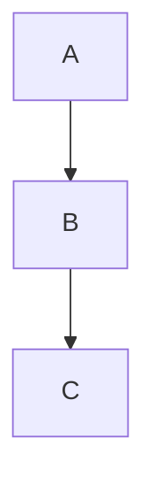

# Cálculo e Algoritmos — Material de Teste

Este documento exercita matemática, código, tabelas, diagramas e estrutura de
headings. Serve de entrada para os três scripts do spike.

## Matemática

A famosa equivalência massa-energia é $E = mc^2$, e a integral gaussiana
$\int_0^\infty e^{-x^2} dx$ converge para $\frac{\sqrt{\pi}}{2}$.

O Teorema Fundamental do Cálculo, em forma de bloco:

$$\frac{d}{dx}\left(\int_0^x f(t)\,dt\right) = f(x)$$

> A matemática é a linguagem com a qual Deus escreveu o universo.
> — atribuído a Galileu Galilei

### Implementação em código

Um exemplo não trivial em JavaScript — memoização de Fibonacci com `Map`:

```javascript
function memoize(fn) {
  const cache = new Map();
  return function (...args) {
    const key = JSON.stringify(args);
    if (cache.has(key)) return cache.get(key);
    const result = fn.apply(this, args);
    cache.set(key, result);
    return result;
  };
}

const fib = memoize((n) => (n < 2 ? n : fib(n - 1) + fib(n - 2)));
console.log(fib(50)); // 12586269025
```

O equivalente em Python, usando `functools.lru_cache`:

```python
from functools import lru_cache

@lru_cache(maxsize=None)
def fib(n: int) -> int:
    if n < 2:
        return n
    return fib(n - 1) + fib(n - 2)

if __name__ == "__main__":
    print([fib(i) for i in range(10)])  # [0, 1, 1, 2, 3, 5, 8, 13, 21, 34]
```

## Tabela de complexidade

Comparação de algoritmos de ordenação por características de desempenho:

| Algoritmo      | Melhor caso | Caso médio | Pior caso  | Memória   | Estável |
|----------------|-------------|------------|------------|-----------|---------|
| Quick Sort     | O(n log n)  | O(n log n) | O(n²)      | O(log n)  | Não     |
| Merge Sort     | O(n log n)  | O(n log n) | O(n log n) | O(n)      | Sim     |
| Heap Sort      | O(n log n)  | O(n log n) | O(n log n) | O(1)      | Não     |
| Insertion Sort | O(n)        | O(n²)      | O(n²)      | O(1)      | Sim     |
| Bubble Sort    | O(n)        | O(n²)      | O(n²)      | O(1)      | Sim     |
| Counting Sort  | O(n + k)    | O(n + k)   | O(n + k)   | O(k)      | Sim     |
| Radix Sort     | O(nk)       | O(nk)      | O(nk)      | O(n + k)  | Sim     |
| Tim Sort       | O(n)        | O(n log n) | O(n log n) | O(n)      | Sim     |

## Diagrama de fluxo

O fluxo de decisão do pipeline de leitura:



Fim do material de teste.
